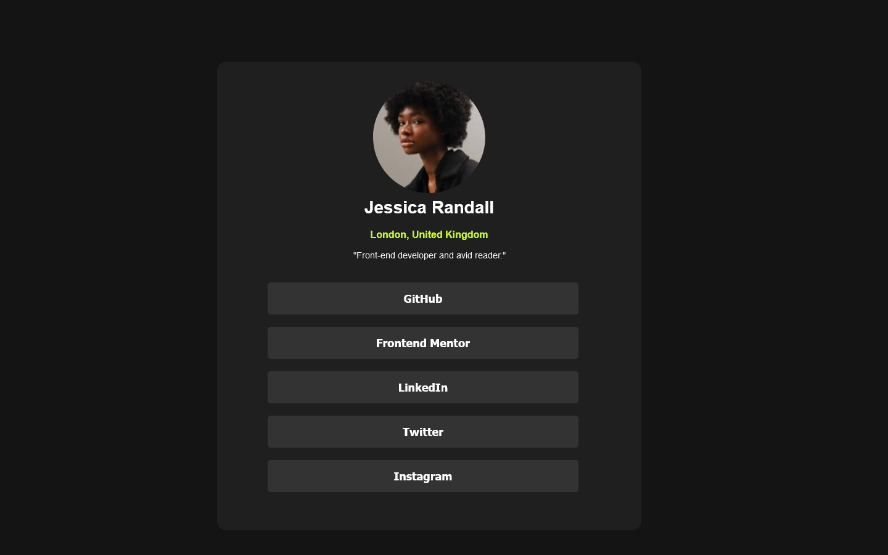

# Frontend Mentor - Social links profile solution

This is a solution to the [Social links profile challenge on Frontend Mentor](https://www.frontendmentor.io/challenges/social-links-profile-UG32l9m6dQ). Frontend Mentor challenges help you improve your coding skills by building realistic projects.

## Table of contents

- [Overview](#overview)
  - [The challenge](#the-challenge)
  - [Screenshot](#screenshot)
  - [Links](#links)
  - [Built with](#built-with)
- [Author](#author)

## Overview

### The challenge

Users should be able to:

- See hover and focus states for all interactive elements on the page

### Screenshot

### Links

- Solution URL: [GitHub Solution URL](https://github.com/ShaunPour/social-links-profile-remake)
- Live Site URL: [GitHub Pages Site](https://ShaunPour.github.io/social-links-profile-remake)

### Built with

- Semantic HTML5 markup
- CSS custom properties
- Flexbox
- Mobile-first workflow

## Author

- Website - [Shaun Pour](https://shaunpour.github.io)
- Frontend Mentor - [@ShaunPour](https://www.frontendmentor.io/profile/ShaunPour)
- LinkedIn - [@shaun-pour](https://www.linkedin.com/in/shaun-pour)
